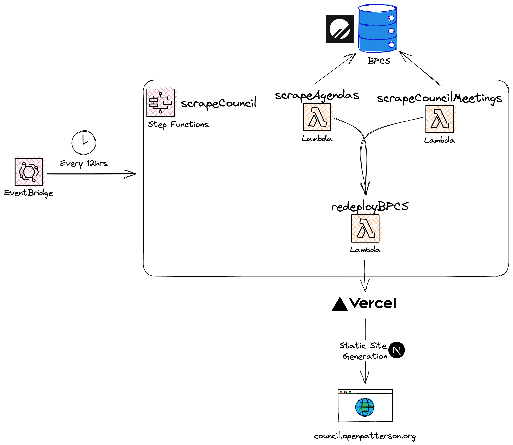

# BPCS
BPCS is the Better Patterson Council Site project. It scrapes all meeting dates, agendas, and relevant links from
the Patterson City Council site to host it on what we hope is a better experience for residents.  

Any questions or feedback can be directed to Carlos at [carlos@openpatterson.org](mailto:carlos@openpatterson.org)

# Development  

The Lambda function code is hosted on the [bpcs-backend repo](https://github.com/OpenPatterson/bpcs-backend).

Our site is hosted on Vercel for its great developer experience.  

Our MySQL DB is hosted on Planetscale. Do note, there are some differences between vanilla MySQL and Planetscale's MySQL.

## Updating Prisma Models from Planetscale DB
If any changes were made to the schema in Planetscale, the easiest way to update Prisma's schema is to:
1. `cd bpcs`
2. `npx prisma db pull`
3. `npx prisma generate`

## The Stack
We partially use the T3 stack. To learn more about the [T3 Stack](https://create.t3.gg/), take a look at the following resources:

- [Documentation](https://create.t3.gg/)
- [Learn the T3 Stack](https://create.t3.gg/en/faq#what-learning-resources-are-currently-available) — Check out these awesome tutorials

You can check out the [create-t3-app GitHub repository](https://github.com/t3-oss/create-t3-app). 

From this we use:  
- [Next.js](https://nextjs.org)  
- [Prisma](https://prisma.io)  
- [Tailwind CSS](https://tailwindcss.com)  
